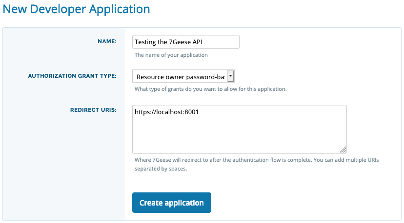

# 7Geese API Authentication example in Node.js
*Disclosure: I am an employee of 7Geese.*

7Geese is an enterprise performance management and employee engagement platform. It helps you and your team to track OKRs, give each other recognition and more.

To automatically track the progress of your OKRs in other applications, you might want to write a script for integrating the two services. You might also want to use data in 7Geese on other platforms, like data analysis dashboards.

While 7Geese might decide that your integration is not requested by enough users to develop it using [7Geese’s RESTful APIs](https://support.7geese.com/hc/en-us/articles/206301887-API-App-Integrations#restful-apis). This repository can help you to make it happen!

If there are any questions or issue, please [file an issue](https://github.com/jaller94/7geese-nodejs-auth-example/issues) or send me a Pull Request. I love every interaction with my projects!

## Limitations
* You need a 7Geese account.
* Your network must use password authentication.
  * Support for external login providers might be added later. It’s possible using an authorization code grant.

## Installation
I assume basic knowledge of [Node.js](https://nodejs.org/) and how to run a project.

After downloading the repository, install all dependencies:

```bash
npm install
```

## Register a new application with 7Geese
7Geese supports several authentication methods. For this demo, the authentication with a password will be demonstrated.

First, you need to register a new application at https://app.7geese.com/account/applications/.

Pick the authorization grant type “Resource owner password-based” and the redirect URI “https://localhost:8001”.



You will be given a client ID and a client secret which you should paste into a file `.env`. An example of this file can be found in this repository and is called `.venv.sample`.

Check how to show hidden files in your operating system, if you don’t see the example file.

## Test the authentication
Additionally, the script requires your user name and password to login. Both should be put into the file `.venv`.

## Execution
To run the script run

```bash
npm start
```

If you need to debug the script, open `scr/index.js` in you editor.
